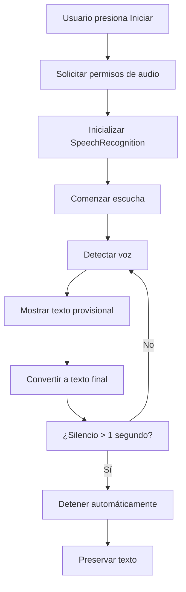

# 🎤 Reconocimiento de Voz a Texto Inteligente

<div align="center">


**Una aplicación web moderna para convertir voz a texto en tiempo real con detección automática de silencio**

[🚀 Demo en Vivo](#) • [📖 Documentación](#características) • [🛠️ Instalación](#instalación)

</div>

---

## 📋 Tabla de Contenidos

- [✨ Características](#características)
- [🎯 Funcionalidades Principales](#funcionalidades-principales)
- [🛠️ Tecnologías Utilizadas](#tecnologías-utilizadas)
- [⚡ Instalación](#instalación)
- [🚀 Uso](#uso)
- [🎮 Controles](#controles)
- [⚙️ Configuración](#configuración)
- [🌐 Compatibilidad](#compatibilidad)
- [📁 Estructura del Proyecto](#estructura-del-proyecto)
- [🔧 Desarrollo](#desarrollo)
- [📝 API Reference](#api-reference)
- [🤝 Contribuciones](#contribuciones)
- [📄 Licencia](#licencia)

---

## ✨ Características

### 🎙️ **Reconocimiento de Voz Avanzado**
- Transcripción en tiempo real con **Speech Recognition API**
- Soporte para **idioma español (es-ES)**
- Detección inteligente de **texto provisional** y **texto final**
- **Detención automática** tras 1 segundo de silencio

### 🎛️ **Interfaz de Usuario Intuitiva**
- Diseño **responsivo** y **centrado**
- Campo de texto con **tamaño fijo** y **scroll automático**
- Indicadores visuales de **estado en tiempo real**
- **Contador de palabras** dinámico

### 🔧 **Funcionalidades Técnicas**
- **Selección de micrófono** múltiple
- **Gestión de permisos** de audio automática
- **Manejo de errores** robusto
- **Preservación de texto** al detener

---

## 🎯 Funcionalidades Principales

| Característica | Descripción | Estado |
|---------------|-------------|---------|
| **🎤 Reconocimiento en Vivo** | Convierte voz a texto instantáneamente | ✅ Activo |
| **⏰ Detención Automática** | Se detiene tras 1 segundo sin voz | ✅ Activo |
| **🎛️ Selector de Micrófono** | Permite elegir entre micrófonos disponibles | ✅ Activo |
| **📊 Contador de Palabras** | Muestra palabras finales y provisionales | ✅ Activo |
| **💾 Preservación de Texto** | Guarda texto al detener manualmente | ✅ Activo |
| **🎨 UI Responsiva** | Diseño adaptable y profesional | ✅ Activo |

---

## 🛠️ Tecnologías Utilizadas

<div align="center">

| Frontend | Herramientas | APIs |
|----------|-------------|------|
|  |  |  |
|  |  |  |

</div>

### 🔍 **Detalles Técnicos:**
- **React Hooks**: `useState`, `useEffect`, `useRef`, `useCallback`
- **Web APIs**: Speech Recognition, MediaDevices
- **Gestión de Estado**: React State Management
- **Estilización**: CSS-in-JS (Inline Styles)

---

## ⚡ Instalación

### 📋 **Prerrequisitos**
- **Node.js** >= 16.0.0
- **npm** >= 8.0.0
- Navegador compatible con **Web Speech API** (Chrome, Edge recomendados)

### 🚀 **Pasos de Instalación**

```bash
# 1. Clonar el repositorio
git clone https://github.com/JHAMILCALI/reconocimiento-de-voz-a-texto.git

# 2. Navegar al directorio
cd reconocimiento-de-voz-a-texto

# 3. Instalar dependencias
npm install

# 4. Iniciar servidor de desarrollo
npm run dev

# 5. Abrir en el navegador
# http://localhost:5173
```

### 📦 **Scripts Disponibles**

```bash
npm run dev      # Servidor de desarrollo
npm run build    # Construir para producción
npm run preview  # Vista previa del build
npm run lint     # Análisis de código con ESLint
```

---

## 🚀 Uso

### 1️⃣ **Configuración Inicial**
1. **Permitir acceso al micrófono** cuando el navegador lo solicite
2. **Seleccionar el micrófono** deseado del dropdown
3. **Verificar el estado** del indicador (DETENIDO/ESCUCHANDO)

### 2️⃣ **Iniciar Transcripción**
```
🎤 Presionar "Iniciar Grabación"
→ El indicador cambia a "ESCUCHANDO..."
→ Comenzar a hablar claramente
→ El texto aparece en tiempo real
```

### 3️⃣ **Detención Automática**
```
⏰ Automática: Se detiene tras 1 segundo de silencio
🛑 Manual: Presionar "Detener Grabación"
💾 El texto se preserva automáticamente
```

---

## 🎮 Controles

| Control | Función | Estado Visual |
|---------|---------|---------------|
| **🎙️ Iniciar Grabación** | Activa el reconocimiento de voz | Verde → Botón activo |
| **⏹️ Detener Grabación** | Detiene la transcripción manualmente | Rojo → Botón activo |
| **🎛️ Selector de Micrófono** | Cambia el dispositivo de entrada | Dropdown con opciones |
| **📊 Campo de Transcripción** | Muestra el texto transcrito | Scroll automático |

### 🎨 **Indicadores Visuales**

```
🟢 ESCUCHANDO...  → Reconocimiento activo
🔴 DETENIDO       → Reconocimiento inactivo
⚪ Texto Negro    → Texto confirmado
🔘 Texto Gris     → Texto provisional
```

---

## ⚙️ Configuración

### 🔧 **Parámetros Configurables**

```javascript
// En VoiceToText.jsx
const [silenceDelay] = useState(1000); // 1 segundo de silencio

// Configuración del reconocimiento
recognition.lang = "es-ES";           // Idioma español
recognition.continuous = true;        // Reconocimiento continuo
recognition.interimResults = true;    // Resultados provisionales
```

### 🎛️ **Personalización de Estilos**

```javascript
// Campo de transcripción
height: "300px"              // Altura fija
overflowY: "auto"           // Scroll vertical
wordWrap: "break-word"      // Ajuste de palabras
whiteSpace: "pre-wrap"      // Preservar espacios
```

---

## 🌐 Compatibilidad

### ✅ **Navegadores Soportados**

| Navegador | Versión Mínima | Estado | Características |
|-----------|----------------|---------|-----------------|
| **Chrome** | 25+ | ✅ Completo | Soporte completo |
| **Edge** | 79+ | ✅ Completo | Soporte completo |
| **Firefox** | ❌ | ⚠️ No soportado | Sin Web Speech API |
| **Safari** | ❌ | ⚠️ Limitado | Soporte parcial |

### 📱 **Dispositivos**
- **Desktop**: Soporte completo
- **Móvil**: Soporte limitado (depende del navegador)
- **Tablet**: Soporte limitado

---

## 📁 Estructura del Proyecto

```
react-speech/
├── 📁 public/
│   └── vite.svg
├── 📁 src/
│   ├── 📄 App.jsx              # Componente principal
│   ├── 🎤 VoiceToText.jsx      # Lógica de reconocimiento
│   ├── 🎨 App.css              # Estilos principales
│   ├── 🎨 index.css            # Estilos globales
│   ├── ⚡ main.jsx             # Punto de entrada
│   └── 📁 assets/
│       └── react.svg
├── 📄 package.json             # Dependencias y scripts
├── 📄 vite.config.js          # Configuración de Vite
├── 📄 eslint.config.js        # Configuración de ESLint
├── 📄 index.html              # Template HTML
└── 📖 README.md               # Documentación
```

---

## 🔧 Desarrollo

### 🏗️ **Arquitectura del Componente**

```javascript
VoiceToText/
├── 🔄 Estados (useState)
│   ├── devices[]           # Lista de micrófonos
│   ├── selectedDeviceId    # Micrófono seleccionado
│   ├── finalTranscript     # Texto confirmado
│   ├── interimTranscript   # Texto provisional
│   └── listening          # Estado de grabación
├── 🎣 Efectos (useEffect)
│   ├── Inicialización     # Setup de APIs
│   └── Cleanup           # Limpieza de recursos
├── 📎 Referencias (useRef)
│   ├── recognitionRef     # Instancia de SpeechRecognition
│   └── silenceTimerRef    # Temporizador de silencio
└── 🎯 Funciones
    ├── startListening()   # Iniciar grabación
    ├── stopListening()    # Detener grabación
    └── resetSilenceTimer() # Reiniciar temporizador
```

### 🔄 **Flujo de Datos**



---

## 📝 API Reference

### 🎤 **VoiceToText Component**

#### Props
```javascript
// No recibe props - componente autónomo
<VoiceToText />
```

#### Estados Internos
```javascript
const [devices, setDevices] = useState([])              // Array de dispositivos
const [selectedDeviceId, setSelectedDeviceId] = useState("") // String
const [finalTranscript, setFinalTranscript] = useState("")   // String
const [interimTranscript, setInterimTranscript] = useState("") // String
const [listening, setListening] = useState(false)           // Boolean
const [silenceDelay] = useState(1000)                      // Number (ms)
```

#### Métodos Principales
```javascript
startListening()    // void - Inicia el reconocimiento
stopListening()     // void - Detiene el reconocimiento
resetSilenceTimer() // void - Reinicia el temporizador
```

---

## 🤝 Contribuciones

### 🌟 **¿Cómo Contribuir?**

1. **Fork** el repositorio
2. **Crear** una rama para tu feature (`git checkout -b feature/nueva-funcionalidad`)
3. **Commit** tus cambios (`git commit -m 'Agregar nueva funcionalidad'`)
4. **Push** a la rama (`git push origin feature/nueva-funcionalidad`)
5. **Abrir** un Pull Request

### 🐛 **Reportar Issues**
- Usar el template de issues de GitHub
- Incluir pasos para reproducir el problema
- Especificar navegador y versión

### 💡 **Ideas de Mejoras**
- [ ] Soporte para más idiomas
- [ ] Exportar transcripción a archivo
- [ ] Grabación de audio
- [ ] Integración con APIs de IA
- [ ] Tema oscuro/claro
- [ ] Comandos de voz

---

## 📄 Licencia

```
MIT License

Copyright (c) 2025 JHAMILCALI

Permission is hereby granted, free of charge, to any person obtaining a copy
of this software and associated documentation files (the "Software"), to deal
in the Software without restriction, including without limitation the rights
to use, copy, modify, merge, publish, distribute, sublicense, and/or sell
copies of the Software, and to permit persons to whom the Software is
furnished to do so, subject to the following conditions:

The above copyright notice and this permission notice shall be included in all
copies or substantial portions of the Software.

THE SOFTWARE IS PROVIDED "AS IS", WITHOUT WARRANTY OF ANY KIND, EXPRESS OR
IMPLIED, INCLUDING BUT NOT LIMITED TO THE WARRANTIES OF MERCHANTABILITY,
FITNESS FOR A PARTICULAR PURPOSE AND NONINFRINGEMENT.
```

---

<div align="center">

### 🚀 **¡Proyecto Desarrollado con Pasión!**

**Si te gusta este proyecto, no olvides darle una ⭐ en GitHub**

[](https://github.com/JHAMILCALI/reconocimiento-de-voz-a-texto)
[](https://github.com/JHAMILCALI/reconocimiento-de-voz-a-texto)

---

**Hecho con ❤️ por [JHAMILCALI](https://github.com/JHAMILCALI)**

</div>
